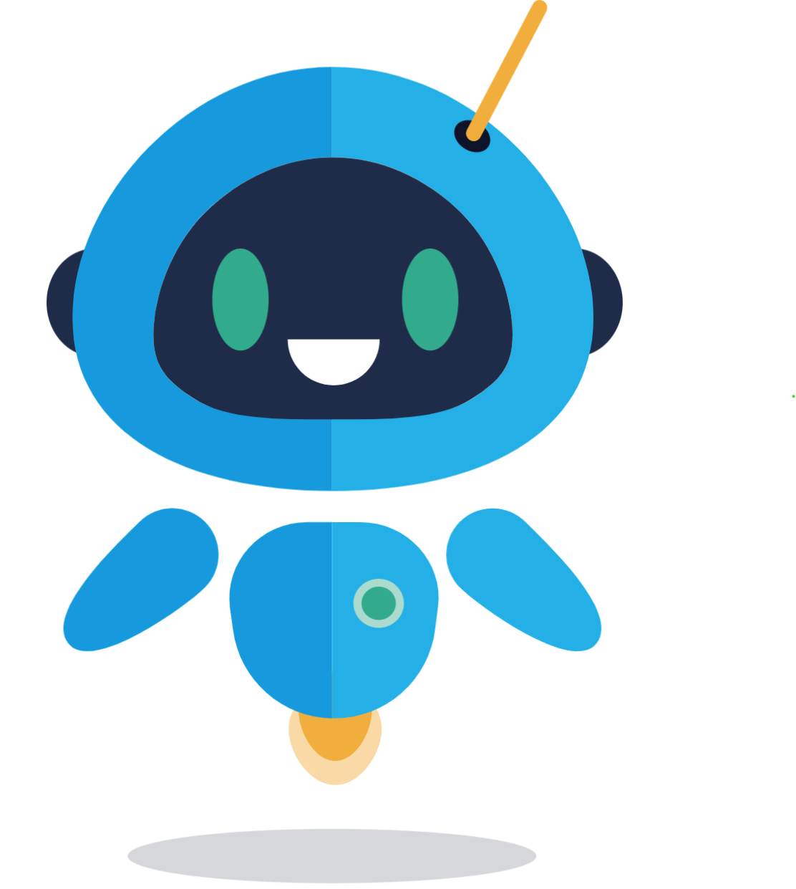
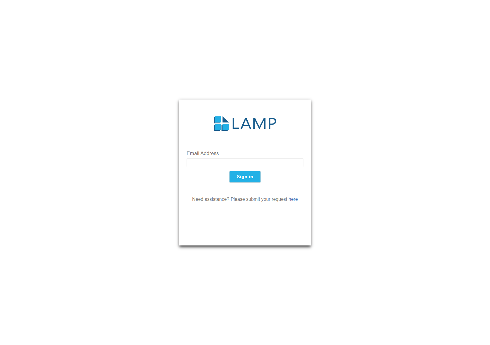
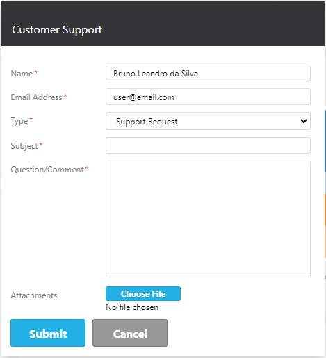
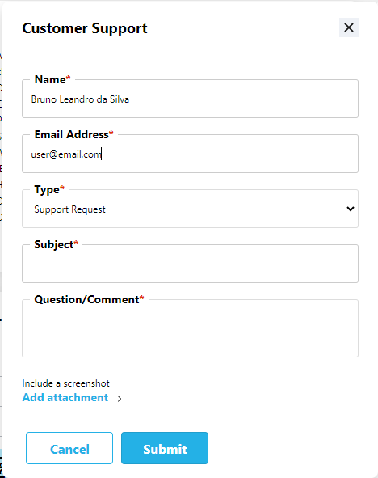

# App-Redesign 💅🏼

Redesigning an application involves a comprehensive process aimed at enhancing user experience, improving functionality, updating technology, and aligning with evolving business goals, without compromising accessability standards.

Here's an overview of the process and reasons why a business should consider a redesign

- Outdated User Interface (UI)/User Experience (UX)
- Technological Obsolescence
- Changing Business Needs
- Competitive Advantage
- Mobile Optimization
- Performance Optimization
- Adhering to accessibility standards

## Tools 🛠️

- Figma
- Storybooks
- Scss
- SVGs Components

This was a UI upgrade so all project core logic remained the same, the design was completed in Figma and then incorporated into the application.

However, in order to modernize the code base, this was the perfect opportunity to introduce SCSS to help minimize the number of code processes and Storybooks for the react components design system.

## Redesign Process 👌

- Conduct a comprehensive analysis of the existing application, including its features, functionalities, user feedback, and performance metrics. Identify strengths, weaknesses, and areas for improvement.

- Define Objectives and Goals: Clearly define the objectives and goals of the redesign. Determine what aspects of the application need improvement and establish benchmarks for success.

- User Research and Feedback: Gather feedback from users through surveys, interviews, and usability testing. Identify user pain points, preferences, and expectations to inform the redesign process.

- Information Architecture and Wireframing: Develop a new information architecture and create wireframes to visualize the layout, structure, and navigation flow of the redesigned application. This helps in planning the user interface and interactions.

- Visual Design: Create visual designs, including color schemes, typography, and graphical elements, to enhance the aesthetics and usability of the application. Ensure consistency and alignment with the brand identity.

- Prototyping and Testing: Build interactive prototypes of the redesigned application to simulate user interactions and validate design decisions. Conduct usability testing to gather feedback and iterate on the design based on user responses.

- Development and Implementation: Implement the redesigned application using modern technologies and development practices. Follow agile methodologies to iteratively develop and deploy new features while ensuring quality and stability.

- Launch and Feedback Loop: Roll out the redesigned application to users and gather feedback on its performance and usability. Monitor key metrics and user engagement to evaluate the effectiveness of the redesign. Iterate on the design based on user feedback and evolving business requirements.

- Maintenance and Continuous Improvement: Regularly monitor and maintain the application to address any issues or bugs that may arise post-launch. Continuously collect user feedback and analyze usage data to identify opportunities for further optimization and enhancement.

## Results Before and After 🤩

### Mascot

### Login page

### Loading state

### Dash Board

## Customer Support

---

Please note that the intention of this article is to show case my work, The data displayed is dummy data

